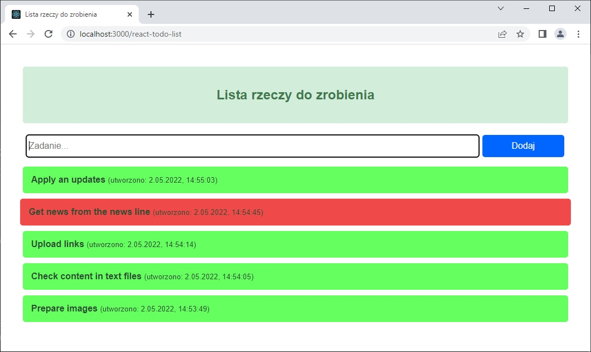

# React lista TODO



Prosta aplikacja webowa oparta na bibliotece [React](https://pl.reactjs.org/) do zarządzania listą rzeczy do zrobienia (TODO). Działająca aplikacja umieszczona pod adresem https://beskider.github.io/react-todo-list

## Użyte technologie

* [React](https://pl.reactjs.org/)
* [Create React App](https://github.com/facebook/create-react-app)
* [React Flip Move](https://github.com/joshwcomeau/react-flip-move/)
* [gh-pages](https://www.npmjs.com/package/gh-pages/)

## Uruchamianie

```
	$ ./npm start
```

***

# React TODO list


Simple [React](https://pl.reactjs.org/) webapp to manage the TODO tasks. Working copy at https://beskider.github.io/react-todo-list

## Technologies

* [React](https://pl.reactjs.org/)
* [Create React App](https://github.com/facebook/create-react-app)
* [React Flip Move](https://github.com/joshwcomeau/react-flip-move/)
* [gh-pages](https://www.npmjs.com/package/gh-pages/)

## Running

```
	$ ./npm start
```
